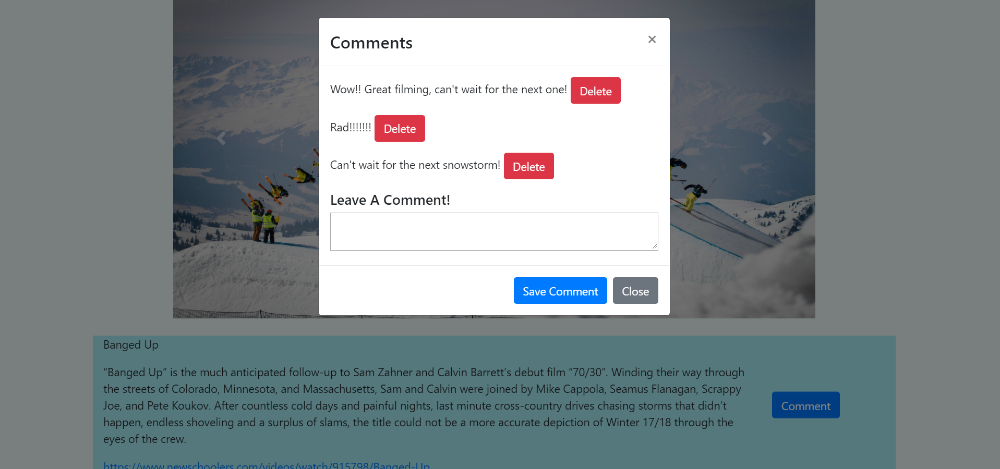

# Ski News Scraper

## Description
This application allows user to scrape news articles from http://www.newschoolers.com, save articles on a seperate page, and add/delete comments on specific articles. Each article contains a headline, summary, and a url link to the original. This application utilizes Node.js/Express for the server, MongoDB/Mongoose for the database, Cheerio/Axios for scraping, and Handlebars for the layout.

[View the Deployed Site](https://rocky-brook-53317.herokuapp.com/)

## Installation
1. To use this application you will need [Node.js](https://nodejs.org/en/download/) and [MongoDB](https://www.mongodb.com/download-center) installed on your machine.

2. Open up your Command Line Interface, run ```mongod```, and keep it running.

3. In a new Command Line Interface, open the root directory of the application and install all dependencies by running 
```npm install```

4. Once the dependencies are installed, enter ```node server``` and navigate to http://localhost:3000 to view the application live.

## Screenshots



